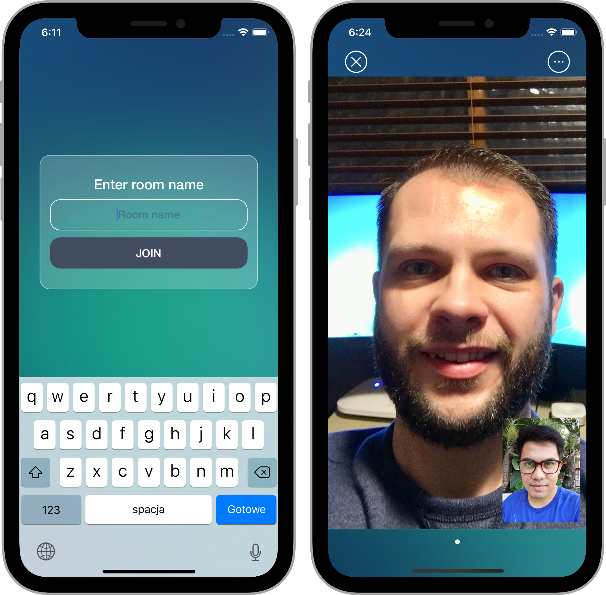

# ASMediaStream

[](https://travis-ci.org/mietelski.robert@gmail.com/ASMediaStream)
[](https://cocoapods.org/pods/ASMediaStream)
[](https://cocoapods.org/pods/ASMediaStream)
[](https://cocoapods.org/pods/ASMediaStream)

## Screenshots



## Example

To run the example project, clone the repo, and run `pod install` from the Example directory first.

## Features

- [x] Group Video
- [x] Send data

## Requirements

- iOS 11.0+
- Xcode 10.0+
- Swift 5.0+

## Installation

ASMediaStream is available through [CocoaPods](https://cocoapods.org). To install
it, simply add the following line to your Podfile:

```ruby
pod 'ASMediaStream'
```

## Author

Robert Mietelski, mietelski.robert@gmail.com

## License

ASMediaStream is available under the MIT license. See the LICENSE file for more info.
